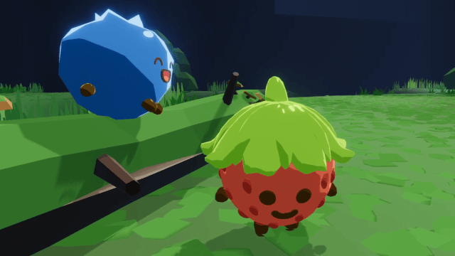

# Awesome Toon Shader
A Character concentric Toon Shader for Unity using Shader Graph.
This shader use a C# helper script on the object to supply lighting data to the material.

### Tutorial
Check out the tutorial for this shader on YouTube:
- Part 1: https://youtu.be/g8eBXCgWwrk
- Part 2: https://youtu.be/CVhyQHJPK7M (Unlisted)

### Awesomeness & Features
- Supports multiple light sources and types
- Adjustable shading bands
- Beautiful gloss and Fresnel effects
- Shade detection with Raycasting ("faked" shadows)

### Drawbacks
- Not ideal for enviroment shading
- One material per character
- Doesn't receive shadows directly
- Lights are relative to the character rather than the actual mesh surface position. This difference is usually not noticable, apart from when you are standing on top of a light source.

# How to use
1. Apply the `AwesomeToonHelper` script to your character (On the Game object with the **Mesh renderer**)
2. Create a material with the `AwesomeToon` shader, and set this as the `Material` input on the `AwesomeToonHelper` component.
3. On the material set a `Shading Gradient` to one of the gradients in this repo, or make your own.
4. Play around!

### Troubleshoot
If the `Awesome Toon Sub` node is not found in the `Awesome Toon` shader, delete it and add it back in again, then save.

